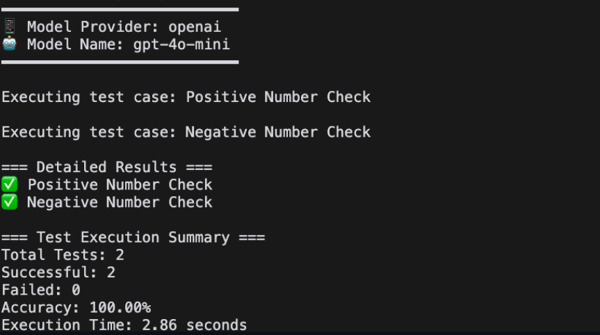

# Code Generator Evaluator

This is a tool designed to evaluate Dify's Code Generator functionality.

## Use Cases

### Prompt Improvement
Use this tool to evaluate and improve Code Generator prompts by:
- Testing different prompt variations
- Analyzing code generation accuracy
- Identifying areas for prompt optimization

### LLM Performance Comparison
Compare code generation accuracy across different LLM models to:
- Measure code quality metrics
- Assess performance across different programming languages(Python and JavaScript)


## Getting Started
### 1. Move to the evaluator directory

```bash
git clone git@github.com:Kota-Yamaguchi/dify-codegenerator-evaluator.git
```

```bash
cd dify-codegenerator-evaluator
```

### 2. Set up your `.env` file with required variables
```bash
cp .env.example .env
```

### 3. Start Dify Backend API
> Note: For instructions on setting up the Dify Backend API locally, please refer to the [Dify Self-hosted Installation Guide](https://docs.dify.ai/getting-started/install-self-hosted/local-source-code)


### 4. Build Prerequisites
- Ensure Go 1.20 or higher is installed
- Verify `GOPATH` is properly configured
- Grant execution permissions to the build script:
```bash
chmod +x build.sh
```

### 5. Build Process
```bash
./build.sh
```

### 6. Run the Evaluator
Execute the evaluator based on your platform:

```bash
# For Linux
./bin/evaluate-code-linux

# For macOS (Intel)
./bin/evaluate-code-mac

# For macOS (Apple Silicon)
./bin/evaluate-code-mac-arm64

# For Windows
./bin/evaluate-code.exe
```

## Adding Test Cases
To add new test cases, please add them to `testdata/testcases.json`.

## Planned Features

- [ ] Generate comparative accuracy graphs for different LLM models
- [ ] Output accuracy metrics based on code complexity levels
